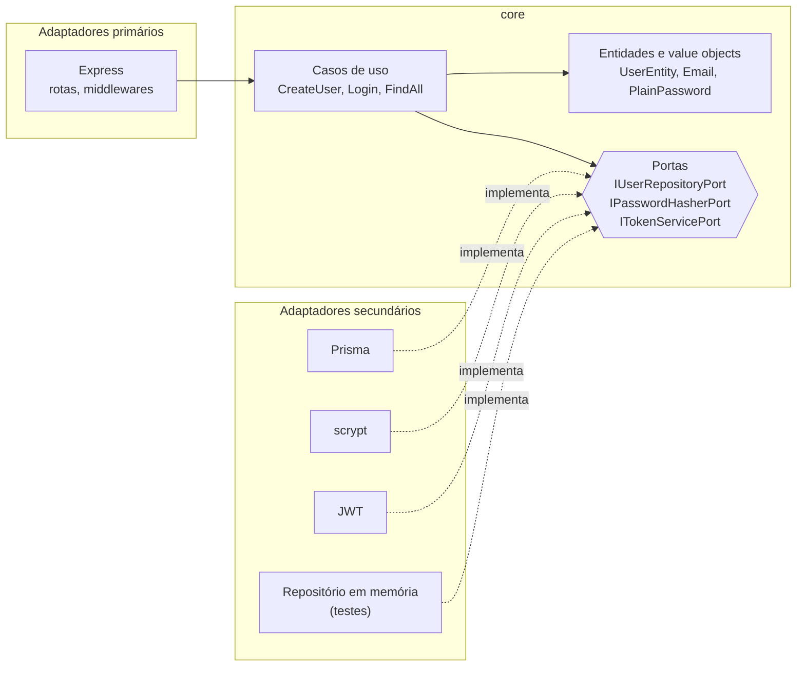

# Arquitetura Hexagonal em TypeScript

API de cadastro e autenticação de usuários escrita para exercitar ports & adapters de verdade, não só na organização de pastas: o núcleo de negócio não importa Express, Prisma nem `jsonwebtoken`, e os 50 testes rodam sem subir banco nenhum.

## A ideia

O núcleo declara o que precisa do mundo em forma de interface. A infraestrutura implementa essas interfaces. A seta de dependência aponta sempre para dentro — nenhum arquivo dentro de `core/` importa alguma coisa de `infrastructure/`.



O único arquivo que conhece as duas pontas é `src/composition/container.ts`, onde as implementações concretas são escolhidas e injetadas.

## Requisitos

Node 22 ou superior e um MySQL. Se não quiser instalar o banco, o `docker compose` sobe os dois.

## Rodando

```bash
cp .env.example .env
```

Gere um segredo e cole em `JWT_SECRET` no `.env` (a aplicação recusa subir com menos de 32 caracteres):

```bash
node -e "console.log(require('crypto').randomBytes(48).toString('base64url'))"
```

Depois:

```bash
npm install
npm run prisma:generate
npm run prisma:migrate
npm run dev
```

O `prisma:generate` não é opcional: o cliente do Prisma é gerado a partir do schema e não vem no `node_modules` pronto.

Com Docker, basta o segredo no `.env`:

```bash
docker compose up --build
```

## Scripts

| Comando | O que faz |
| --- | --- |
| `npm run dev` | Sobe com recarga automática |
| `npm run build` | Compila para `dist/` |
| `npm start` | Executa o build |
| `npm test` | Roda a suíte |
| `npm run test:watch` | Roda a suíte em modo observador |
| `npm run typecheck` | Verifica tipos sem emitir |
| `npm run prisma:generate` | Gera o cliente do Prisma |
| `npm run prisma:migrate` | Aplica as migrations |

## API

| Método | Rota | Autenticação |
| --- | --- | --- |
| `GET` | `/health` | não |
| `POST` | `/users` | não |
| `POST` | `/auth/login` | não |
| `GET` | `/users` | Bearer |
| `GET` | `/users?email=` | Bearer |

### Criar usuário

```bash
curl -X POST localhost:3000/users \
  -H 'content-type: application/json' \
  -d '{"name":"Esdras","email":"esdras@example.com","password":"senha-forte-123"}'
```

```json
{
  "id": "3f2b1c88-9a4d-4f6e-9d2a-77c0b1e4a512",
  "name": "Esdras",
  "email": "esdras@example.com",
  "created_at": "2026-01-01T12:00:00.000Z",
  "updated_at": "2026-01-01T12:00:00.000Z"
}
```

Nenhuma resposta da API devolve senha ou hash, em nenhuma rota.

### Autenticar e consultar

```bash
TOKEN=$(curl -s -X POST localhost:3000/auth/login \
  -H 'content-type: application/json' \
  -d '{"email":"esdras@example.com","password":"senha-forte-123"}' | jq -r .token)

curl localhost:3000/users -H "authorization: Bearer $TOKEN"
```

### Erros

Toda falha sai no mesmo envelope:

```json
{
  "error": {
    "code": "CONFLICT",
    "message": "Usuário já existe."
  }
}
```

Erro de validação de payload acrescenta `details` com o campo e o motivo. Os códigos que o domínio conhece e o status que cada um vira:

| Código | Status | Quando |
| --- | --- | --- |
| `VALIDATION_ERROR` | 400 | Payload malformado, e-mail inválido, senha fora do tamanho aceito |
| `UNAUTHORIZED` | 401 | Token ausente, inválido ou expirado; credencial errada |
| `NOT_FOUND` | 404 | Recurso inexistente ou rota que não existe |
| `CONFLICT` | 409 | E-mail já cadastrado |
| `TOO_MANY_REQUESTS` | 429 | Tentativas de login acima do limite |
| `INTERNAL_ERROR` | 500 | Qualquer falha não prevista, sem detalhe no corpo |

O núcleo não conhece nenhum desses números. Ele lança `DomainError` com o código, e a tradução para status acontece em `httpErrorMap.ts`, dentro do adaptador Express.

## Estrutura

```
src/
  core/                     regras de negócio, sem dependência externa
    entities/               UserEntity, Email, PlainPassword
    exceptions/             DomainError e suas especializações
    ports/                  interfaces que o núcleo exige do mundo
    use-cases/              CreateUser, FindAll, FindByEmail, Login
  infrastructure/
    config/                 leitura e validação do ambiente
    adapters/
      api/express/          rotas, controllers, middlewares, apresentação
      database/prisma/      implementação de IUserRepositoryPort
      security/             scrypt e JWT
      system/               relógio e geração de id
  composition/              onde as implementações concretas são escolhidas
  main.ts
tests/
  support/                  repositório em memória e dublês das portas
```

## Trocando um adaptador

O teste é a demonstração mais direta de que a inversão funciona. Para rodar toda a aplicação contra um repositório em memória, sem MySQL, o que muda é a linha que instancia o repositório:

```ts
const userRepository = new UserPrismaRepository();
```

```ts
const userRepository = new InMemoryUserRepository();
```

Nenhum caso de uso, entidade ou rota precisa saber. É assim que `tests/infrastructure/api.test.ts` sobe o Express de verdade, em porta efêmera, sem banco.

## Decisões

**Erro de domínio carrega código, não status HTTP.** Trocar HTTP por fila ou gRPC não obriga a encostar em caso de uso nenhum.

**Senha tem salt por usuário.** `ScryptPasswordHasher` gera 16 bytes aleatórios por hash e grava os parâmetros de custo no próprio registro (`scrypt$N$r$p$salt$hash`), o que permite endurecer o custo depois sem invalidar as senhas já cadastradas. Hash corrompido no banco devolve `false`, não exceção — uma linha ruim não pode virar 500 e denunciar aquela conta.

**Login não diz qual metade errou.** E-mail inexistente, senha errada e payload malformado produzem a mesma resposta. Quando o usuário não existe, a verificação roda contra `hashThatNeverMatches()`, para o tempo de resposta não entregar quais e-mails estão cadastrados.

**Resposta montada por allowlist.** O presenter escolhe campo a campo o que sai. Coluna nova no schema não vaza por esquecimento.

**Validação em dois lugares, de propósito.** Zod barra payload malformado na borda; `Email` e `PlainPassword` garantem as invariantes dentro do domínio. Quem chamar o caso de uso direto, sem passar por HTTP, continua protegido.

**Só HS256 no JWT.** Sem fixar o algoritmo na verificação, a biblioteca aceita o que o próprio token declara — que é o caminho da falsificação com `alg: none`. Tem teste cobrindo a tentativa.

## Testes

```bash
npm test
```

São 50 testes no runner nativo do Node, sem nenhuma dependência de teste no `package.json`. Nenhum deles precisa de banco.

```
tests 50
pass  50
fail  0
```

## Licença

MIT.
