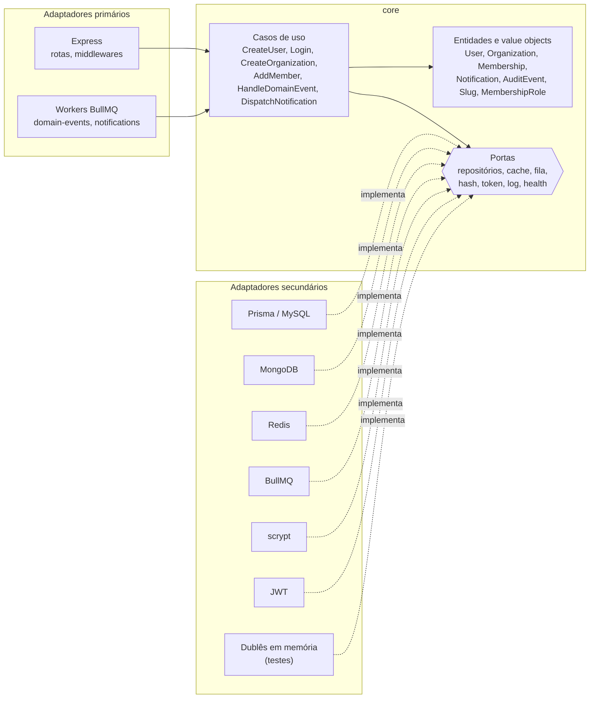
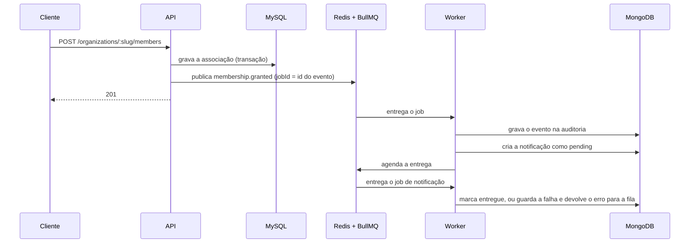

# Arquitetura Hexagonal em TypeScript

API de organizações, membros e autenticação escrita para exercitar ports & adapters de verdade, não só na organização de pastas: o núcleo de negócio não importa Express, Prisma, Redis, BullMQ nem o driver do Mongo, e os 151 testes rodam sem subir infraestrutura nenhuma.

Cada peça de infraestrutura entrou porque o domínio pediu, não para engrossar o currículo:

| Peça | Papel | Onde encosta |
| --- | --- | --- |
| MySQL | Dados com invariante relacional: slug único, um membro por organização, chave estrangeira | `IUserRepositoryPort`, `IOrganizationRepositoryPort`, `IMembershipRepositoryPort` |
| Redis | Cache de leitura, contador do rate limit e lista de tokens revogados | `ICachePort`, `IRevokedTokenStorePort`, `Store` do `express-rate-limit` |
| BullMQ | Tirar efeito colateral do caminho da requisição, com retentativa e backoff | `IEventPublisherPort`, `INotificationSchedulerPort` |
| MongoDB | Coleções append-only e de formato variável: auditoria e notificações | `IAuditEventRepositoryPort`, `INotificationRepositoryPort` |

## A ideia

O núcleo declara o que precisa do mundo em forma de interface. A infraestrutura implementa essas interfaces. A seta de dependência aponta sempre para dentro — nenhum arquivo dentro de `core/` importa alguma coisa de `infrastructure/`.


```mermaid
flowchart LR
  subgraph primarios[Adaptadores primários]
    express["Express<br/>rotas, middlewares"]
    worker["Workers BullMQ<br/>domain-events, notifications"]
  end

  subgraph nucleo[core]
    casos["Casos de uso<br/>CreateUser, Login, CreateOrganization,<br/>AddMember, HandleDomainEvent, DispatchNotification"]
    dominio["Entidades e value objects<br/>User, Organization, Membership,<br/>Notification, AuditEvent, Slug, MembershipRole"]
    portas{{"Portas<br/>repositórios, cache, fila,<br/>hash, token, log, health"}}
  end

  subgraph secundarios[Adaptadores secundários]
    prisma["Prisma / MySQL"]
    mongo["MongoDB"]
    redis["Redis"]
    bull["BullMQ"]
    scrypt["scrypt"]
    jwt["JWT"]
    memoria["Dublês em memória<br/>(testes)"]
  end

  express --> casos
  worker --> casos
  casos --> dominio
  casos --> portas
  prisma -. implementa .-> portas
  mongo -. implementa .-> portas
  redis -. implementa .-> portas
  bull -. implementa .-> portas
  scrypt -. implementa .-> portas
  jwt -. implementa .-> portas
  memoria -. implementa .-> portas
```

Os únicos arquivos que conhecem as duas pontas são `src/composition/`, onde as implementações concretas são escolhidas e injetadas.

## O caminho de um efeito colateral

Nenhum caso de uso sabe que existe fila. Ele registra um evento de domínio numa porta; quem transporta isso é problema do adaptador.


```mermaid
sequenceDiagram
  participant C as Cliente
  participant A as API
  participant M as MySQL
  participant R as Redis + BullMQ
  participant W as Worker
  participant D as MongoDB

  C->>A: POST /organizations/:slug/members
  A->>M: grava a associação (transação)
  A->>R: publica membership.granted (jobId = id do evento)
  A-->>C: 201
  R->>W: entrega o job
  W->>D: grava o evento na auditoria
  W->>D: cria a notificação como pending
  W->>R: agenda a entrega
  R->>W: entrega o job de notificação
  W->>D: marca entregue, ou guarda a falha e devolve o erro para a fila
```

Se o Redis estiver fora, a associação já está gravada e a resposta sai igual: a publicação falha, vira log de erro e o caminho principal não cai. A contrapartida está em [Decisões](#decisões).

## Requisitos

Node 22 ou superior, MySQL, Redis e MongoDB. O `docker compose` sobe tudo — banco, cache, documentos, API e worker — se você não quiser instalar nada.

## Rodando

```bash
cp .env.example .env
```

Gere um segredo e cole em `JWT_SECRET` no `.env` (a aplicação recusa subir com menos de 32 caracteres):

```bash
node -e "console.log(require('crypto').randomBytes(48).toString('base64url'))"
```

Depois:

```bash
npm install
npm run prisma:generate
npm run prisma:migrate
npm run dev
npm run dev:worker   # em outro terminal
```

O `prisma:generate` não é opcional: o cliente do Prisma é gerado a partir do schema e não vem no `node_modules` pronto.

A API e o worker são processos separados de propósito — dá para escalar os dois em ritmos diferentes, e um deploy que derruba a API não perde job nenhum. Sem o worker no ar, a API continua respondendo: os eventos ficam esperando na fila.

Com Docker, basta o segredo no `.env`:

```bash
docker compose up --build
```

Se você já tem Redis ou Mongo ocupando as portas padrão da máquina, o compose publica o Redis em `6380` e respeita `REDIS_HOST_PORT` e `MONGO_HOST_PORT` do `.env`. Dentro da rede do compose os serviços continuam se falando nas portas originais.

## Scripts

| Comando | O que faz |
| --- | --- |
| `npm run dev` | Sobe a API com recarga automática |
| `npm run dev:worker` | Sobe os workers com recarga automática |
| `npm run build` | Compila para `dist/` |
| `npm start` | Executa a API compilada |
| `npm run start:worker` | Executa os workers compilados |
| `npm test` | Roda a suíte |
| `npm run test:watch` | Roda a suíte em modo observador |
| `npm run typecheck` | Verifica tipos sem emitir |
| `npm run prisma:generate` | Gera o cliente do Prisma |
| `npm run prisma:migrate` | Aplica as migrations |

## Configuração

Além das quatro URLs de infraestrutura e do `JWT_SECRET`, o que costuma valer ajuste:

| Variável | Padrão | Para que serve |
| --- | --- | --- |
| `LOG_LEVEL` | `info` | Corta os níveis abaixo dele no log estruturado |
| `CACHE_NAMESPACE` | `hexagonal` | Prefixo de todas as chaves no Redis, inclusive as do BullMQ |
| `CACHE_TTL_SECONDS` | `60` | Validade do cache de organizações |
| `QUEUE_CONCURRENCY` | `5` | Jobs simultâneos por worker |
| `QUEUE_JOB_ATTEMPTS` | `5` | Tentativas antes de o job desistir |
| `QUEUE_BACKOFF_MILLISECONDS` | `1000` | Base do backoff exponencial |
| `AUDIT_RETENTION_DAYS` | `180` | Índice TTL que expira a auditoria no Mongo |
| `READINESS_TIMEOUT_MILLISECONDS` | `2000` | Paciência do `/health/ready` com cada dependência |

## API

| Método | Rota | Quem pode |
| --- | --- | --- |
| `GET` | `/health` | qualquer um |
| `GET` | `/health/ready` | qualquer um |
| `POST` | `/users` | qualquer um |
| `POST` | `/auth/login` | qualquer um, com limite de tentativas |
| `POST` | `/auth/logout` | autenticado |
| `GET` | `/users` e `/users?email=` | autenticado |
| `GET` | `/me/notifications` | autenticado |
| `POST` | `/organizations` | autenticado |
| `GET` | `/organizations` | autenticado |
| `GET` | `/organizations/:slug` | membro |
| `PATCH` | `/organizations/:slug` | owner ou admin |
| `GET` | `/organizations/:slug/members` | membro |
| `POST` | `/organizations/:slug/members` | owner ou admin |
| `PATCH` | `/organizations/:slug/members/:userId` | owner ou admin, respeitando hierarquia |
| `DELETE` | `/organizations/:slug/members/:userId` | owner ou admin, respeitando hierarquia |
| `GET` | `/organizations/:slug/audit-events` | owner ou admin |

### Papéis

| Papel | Lê a organização | Gerencia membros | Renomeia e lê auditoria |
| --- | --- | --- | --- |
| `owner` | sim | sim, inclusive outros owners | sim |
| `admin` | sim | sim, exceto owners | sim |
| `member` | sim | não | não |

Ninguém concede um papel acima do próprio, e a organização nunca fica sem `owner`: rebaixar ou remover o último devolve 409.

### Criar usuário e autenticar

```bash
curl -X POST localhost:3000/users \
  -H 'content-type: application/json' \
  -d '{"name":"Esdras","email":"esdras@example.com","password":"senha-forte-123"}'

TOKEN=$(curl -s -X POST localhost:3000/auth/login \
  -H 'content-type: application/json' \
  -d '{"email":"esdras@example.com","password":"senha-forte-123"}' | jq -r .token)
```

Nenhuma resposta da API devolve senha ou hash, em nenhuma rota.

### Criar organização e convidar

```bash
curl -X POST localhost:3000/organizations \
  -H "authorization: Bearer $TOKEN" -H 'content-type: application/json' \
  -d '{"name":"Banda do Zé"}'
```

```json
{
  "id": "3f2b1c88-9a4d-4f6e-9d2a-77c0b1e4a512",
  "name": "Banda do Zé",
  "slug": "banda-do-ze",
  "owner_id": "8c1f0b4e-2a77-4d6e-9f4d-1c889a4d3f2b",
  "created_at": "2026-01-01T12:00:00.000Z",
  "updated_at": "2026-01-01T12:00:00.000Z"
}
```

O slug sai do nome quando não é informado: acento, pontuação e espaço viram um identificador de URL.

```bash
curl -X POST localhost:3000/organizations/banda-do-ze/members \
  -H "authorization: Bearer $TOKEN" -H 'content-type: application/json' \
  -d '{"email":"zelia@example.com","role":"admin"}'
```

Quem entrou recebe a notificação em `/me/notifications`, e o convite aparece no rastro em `/organizations/banda-do-ze/audit-events`. Os dois passaram pela fila, então levam alguns instantes — não são gravados dentro da requisição.

### Auditoria

```bash
curl "localhost:3000/organizations/banda-do-ze/audit-events?event=membership.granted&limit=20" \
  -H "authorization: Bearer $TOKEN"
```

Os eventos que o domínio publica:

`user.registered`, `user.logged-in`, `user.logged-out`, `organization.created`, `organization.renamed`, `membership.granted`, `membership.role-changed`, `membership.revoked`.

### Encerrar a sessão

```bash
curl -X POST localhost:3000/auth/logout -H "authorization: Bearer $TOKEN"
```

O token continua com assinatura válida e prazo aberto, mas o `jti` dele entra numa lista no Redis com validade igual ao que faltava do prazo. A próxima requisição com ele responde 401.

### Erros

Toda falha sai no mesmo envelope:

```json
{
  "error": {
    "code": "CONFLICT",
    "message": "Usuário já existe."
  }
}
```

Erro de validação de payload acrescenta `details` com o campo e o motivo. Os códigos que o domínio conhece e o status que cada um vira:

| Código | Status | Quando |
| --- | --- | --- |
| `VALIDATION_ERROR` | 400 | Payload malformado, e-mail inválido, slug fora do formato, papel inexistente |
| `UNAUTHORIZED` | 401 | Token ausente, inválido, expirado ou revogado; credencial errada |
| `FORBIDDEN` | 403 | Papel insuficiente para a ação |
| `NOT_FOUND` | 404 | Recurso inexistente, organização que não é sua, rota que não existe |
| `CONFLICT` | 409 | E-mail ou slug já cadastrado, membro repetido, organização sem owner |
| `TOO_MANY_REQUESTS` | 429 | Tentativas de login acima do limite |
| `SERVICE_UNAVAILABLE` | 503 | Dependência crítica fora do ar |
| `INTERNAL_ERROR` | 500 | Qualquer falha não prevista, sem detalhe no corpo |

O núcleo não conhece nenhum desses números. Ele lança `DomainError` com o código, e a tradução para status acontece em `httpErrorMap.ts`, dentro do adaptador Express.

## Estrutura

```
src/
  core/                     regras de negócio, sem dependência externa
    entities/               User, Organization, Membership, Notification, AuditEvent
      value-objects/        Email, PlainPassword, Slug, MembershipRole
    events/                 contrato do evento de domínio e o gravador
    exceptions/             DomainError e suas especializações
    ports/                  interfaces que o núcleo exige do mundo
    services/               regras compartilhadas entre casos de uso
    use-cases/              user, auth, organization, membership, notification, audit, events, health
  infrastructure/
    config/                 leitura e validação do ambiente
    adapters/
      api/express/          rotas, controllers, middlewares, apresentação
      cache/                cache no Redis e o decorador que tolera queda
      database/prisma/      repositórios relacionais
      database/mongo/       repositórios de documento, com criação de índices
      queue/bullmq/         publicação, agendamento e workers
      health/               sondas de MySQL, Redis, Mongo e filas
      notification/         entrega da notificação
      observability/        log estruturado em JSON
      redis/                fábrica das conexões
      security/             scrypt, JWT e revogação de token
      system/               relógio e geração de id
  composition/              onde as implementações concretas são escolhidas
  main.ts                   processo da API
  worker.ts                 processo dos workers
tests/
  support/                  dublês de todas as portas e montagem da aplicação de teste
```

## Trocando um adaptador

O teste é a demonstração mais direta de que a inversão funciona. `tests/support/buildTestApp.ts` sobe a aplicação inteira — Express de verdade, em porta efêmera — com MySQL, Redis, BullMQ e Mongo trocados por dublês em memória. A fila, ali, é uma chamada direta:

```ts
public async publish(event: IDomainEvent): Promise<void> {
  await this.handleDomainEvent.Execute(event);

  for (const notificationId of this.scheduler.Drain()) {
    await this.dispatchNotification.Execute(notificationId);
  }
}
```

Com isso o teste de API afirma, sem infraestrutura, que cadastrar um usuário gera a notificação de boas-vindas e que convidar alguém deixa rastro na auditoria. Nenhum caso de uso, entidade ou rota precisou saber da troca.

## Decisões

**Erro de domínio carrega código, não status HTTP.** Trocar HTTP por fila ou gRPC não obriga a encostar em caso de uso nenhum — e é literalmente o que o worker faz: os mesmos casos de uso, sem Express na frente.

**Senha tem salt por usuário.** `ScryptPasswordHasher` gera 16 bytes aleatórios por hash e grava os parâmetros de custo no próprio registro (`scrypt$N$r$p$salt$hash`), o que permite endurecer o custo depois sem invalidar as senhas já cadastradas. Hash corrompido no banco devolve `false`, não exceção — uma linha ruim não pode virar 500 e denunciar aquela conta.

**Login não diz qual metade errou.** E-mail inexistente, senha errada e payload malformado produzem a mesma resposta. Quando o usuário não existe, a verificação roda contra `hashThatNeverMatches()`, para o tempo de resposta não entregar quais e-mails estão cadastrados.

**Token tem `jti` para poder morrer antes do prazo.** JWT é sem estado, o que é ótimo até alguém precisar de logout. O `jti` vai na lista de revogados do Redis com TTL igual ao tempo restante do token: a lista se limpa sozinha e nunca cresce além das sessões vivas.

**Revogação falha fechada, rate limit falha aberto.** São escolhas opostas de propósito. Sem conseguir consultar a lista de revogados, a API responde 503 em vez de aceitar um token que talvez esteja cancelado. Sem conseguir contar tentativas de login, ela deixa passar e registra erro — um Redis instável não vai trancar todo mundo para fora. O primeiro protege conta invadida; o segundo protege disponibilidade.

**Cache não é dono da verdade e não derruba requisição.** Só a lista de organizações do usuário é cacheada, com invalidação explícita por quem escreve: entrou, saiu ou renomeou, a chave morre. `ResilientCache` embrulha o Redis e transforma qualquer falha em log e cache vazio, então o pior caso de um cache fora do ar é ir ao banco.

**Escrita relacional onde há invariante, documento onde não há.** Slug único, um membro por organização e chave estrangeira são garantidos pelo MySQL, não por `if` da aplicação; criar organização e a associação do dono acontece numa transação, por um único método de porta. Auditoria e notificação são append-only, de formato variável e alto volume: vão para o Mongo, com índice TTL fazendo a expiração da auditoria virar problema do banco.

**Efeito colateral não mora no caminho da requisição.** Auditar e notificar acontece no worker. A requisição responde depois de gravar o que é dela, e o resto atravessa a fila com backoff exponencial e cinco tentativas.

**Job é idempotente por construção.** O `jobId` na fila de eventos é o id do evento, e a notificação nasce com o id do evento que a originou. Republicar o mesmo evento não duplica auditoria (`$setOnInsert`), notificação (a criação verifica antes) nem entrega (`DispatchNotification` sai na hora se já está entregue). Retentativa deixa de ser um risco.

**Erro de domínio na fila é falha definitiva.** `VALIDATION_ERROR`, `NOT_FOUND` e `FORBIDDEN` viram `UnrecoverableError`: tentar de novo cinco vezes uma notificação cujo destinatário não existe só queima recurso. Falha de rede continua com direito a retentativa.

**Não-membro recebe 404, não 403.** Um 403 confirmaria que a organização existe. Quem não é membro não distingue "não é sua" de "não existe".

**Liveness e readiness são perguntas diferentes.** `/health` diz se o processo está vivo e é o que o orquestrador usa para reiniciar. `/health/ready` consulta MySQL, Redis, Mongo e as filas em paralelo, com timeout individual, e responde 503 nomeando quem caiu — é o que o balanceador usa para tirar a instância da rotação.

**Toda requisição tem identidade.** O `x-request-id` do cliente é reaproveitado quando é seguro, gerado quando não vem, devolvido no cabeçalho, registrado no log e gravado no evento de auditoria. A mesma string liga o 500 do log ao que ficou no banco.

**Resposta montada por allowlist.** O presenter escolhe campo a campo o que sai. Coluna nova no schema não vaza por esquecimento.

**Validação em dois lugares, de propósito.** Zod barra payload malformado na borda; `Email`, `PlainPassword`, `Slug` e `MembershipRole` garantem as invariantes dentro do domínio. Quem chamar o caso de uso direto, sem passar por HTTP, continua protegido.

**Só HS256 no JWT.** Sem fixar o algoritmo na verificação, a biblioteca aceita o que o próprio token declara — que é o caminho da falsificação com `alg: none`. Tem teste cobrindo a tentativa.

**Limitação conhecida: não há outbox.** O evento é publicado depois do commit. Se o Redis cair exatamente nessa janela, o dado relacional está salvo e o evento se perde — sobra o log de erro. Auditoria com exigência legal pediria tabela de outbox e um processo varrendo o que não foi publicado; aqui a troca foi consciente, em favor de menos peça.

## Testes

```bash
npm test
```

São 151 testes no runner nativo do Node, sem nenhuma dependência de teste no `package.json`. Nenhum deles precisa de MySQL, Redis ou Mongo.

```
tests 151
pass  151
fail  0
```

Além do caminho feliz, a suíte cobre o que costuma passar batido: hierarquia de papéis, organização sem owner, cache servido e invalidado, evento publicado com os metadados que a notificação consome, reprocessamento de job, notificação que falha e volta para a fila, dependência que nunca responde no readiness, cache fora do ar e `jti` revogado.

## Licença

MIT.
